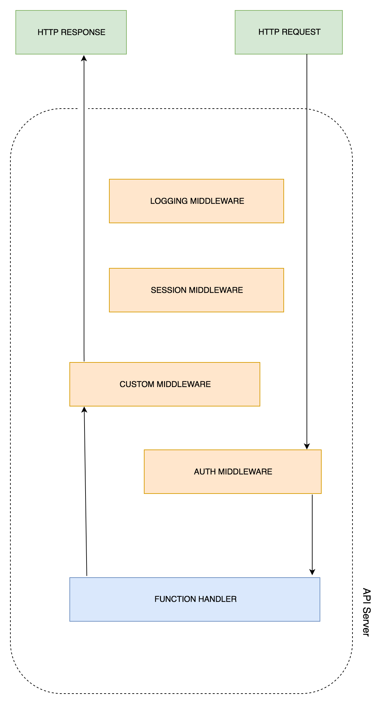
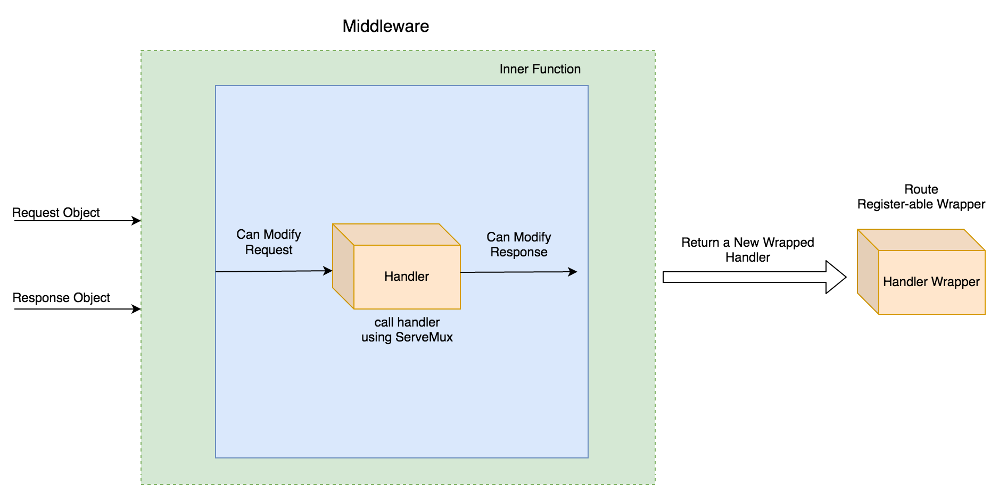

学习目标：

- 了解什么是 middleware
- 多个中间件以及链式调用
- 使用 Alice 进行链式调用
- 使用 Gorilla handlers middleware 进行日志记录
- 了解什么是RPC
- 使用Gorilla RPC 中的 JSON-RPC

## 中间件概述

中间件贯穿于整个服务器处理响应请求的过程，它可以在许多组件中定义。在我们之前学习定义路由和相关处理函数的时候，这个处理函数会对每一个请求执行相应的处理逻辑；而中间件作用的位置就在 请求到处理函数或者处理函数到响应之间。所以，中间件实际上做了这些事情：

- 在请求到达处理函数之前进行操作
- 将处理过相应逻辑操作的请求传送到处理函数
- 在响应到达处理函数之前进行操作
- 将处理过的响应返回给客户端

整个流程大概如图所示：



从图中可以看到，请求从客户端发过来之后，先经过了 AUTH MIDDLEWARE ,然后到达 FUNCTION HANDLER;响应的数据会经过 CUSTOM MIDDLEWARE,之后将处理过的响应返回给用户。如果是一个没有中间件的服务，请求直接到达 function handler 之后直接返回给客户端响应；如果配置了中间件，那么它会经过一系列的阶段，比如说 日志处理、用户认证、session 验证等等，最后才到达真正执行路由的逻辑。

这些中间件的应用场景是：

- 使用 logger 记录每一次请求的日志
- 验证用户 session 保证会话连接存活
- 认证用户信息
- 在响应中添加附加信息

中间件的作用就是当许多路由处理函数需要处理相同的逻辑功能时，可以把这些功能抽离封装起来。有了中间件，我们就可以适当的位置执行任何的日常操作，比如说认证功能。接下来让我们创建一个中间件并尝试更改HTTP请求。

### 创建一个简单的中间件

中间件的创建可以基于闭包（一个闭包方法返回另外一个方法）。这就类似于JavaScript的链式方法，一个中间件返回另外一个方法，这个方法可以是一个中间件，也可以是一个其他的中间件。我们先来举一个闭包的例子：

1. 创建项目文件，初始化mod

   ```shell
   mkdir closureExample
   cd closureExample
   touch main.go
   go mod init closure
   ```

2. 编辑main.go文件，其中最重要的就是generator 函数，这个函数返回一个匿名函数（没有参数返回整数值）。其中变量 i 定义在 generator 函数内部，会被返回的匿名函数捕获，它的状态会被记住，并在每一调用这个匿名函数的时候被更新。

   ```go
   package main
   
   import "fmt"
   
   // This function returns another function
   func generator() func () int {
   	var i = 0
   	return func () int {
   		i++
   		return i
   	}
   }
   
   func main() {
   	numGenerator := generator()
   	for i := 0; i< 5; i++ {
   		fmt.Print(numGenerator(), "\t")
   	}
   }
   ```

3. 测试执行

   ```go
   ➜  closureExample go run main.go
   1	2	3	4	5
   ```

了解了闭包的工作原理之后，我们开始利用它创建中间件：任何一个生成函数，它的返回函数满足接口 http.Handler ，那么它就是一个中间件。举例如下：

1. 照例创建项目目录

   ```shell
   mkdir customMiddleware
   cd customMiddleware
   touch main.go
   go mod init middleware
   ```

2. 编写 main.go 文件

   ```go
   package main
   
   import (
   	"fmt"
   	"net/http"
   )
   
   func middleware(originalHandler http.Handler) http.Handler {
   	return http.HandlerFunc(func(w http.ResponseWriter, r *http.Request){
   		fmt.Println("Executing middleware before request phase!")
   		// Pass control back to the handler
   		originalHandler.ServeHTTP(w, r)
   		fmt.Println("Executing middleware after response phase!")
   	})
   }
   
   func handle (w http.ResponseWriter, r *http.Request){
   	// Business logic goes here
   	fmt.Println("Executing mainHandler....")
   	w.Write([]byte("OK"))
   }
   
   func main() {
   	// HandlerFunc returns a HTTP Handler
   	originalHandler := http.HandlerFunc(handle)
   	http.Handle("/", middleware(originalHandler))
   	http.ListenAndServe(":8000", nil)
   }
   ```

   中间件函数接收一个正常的HTTP路由处理函数作为参数，它返回另外一个路由处理函数。可以看到在中间件中，仍然执行原始函数的逻辑操作，但是在它执行的前后，分别做了 middleware 函数想要做的事情，可以分别操作 request 和 response 对象。这样所有去路由函数的请求都会经过中间件的处理逻辑。

3. 执行结果

   ```go
   ➜  ~ curl http://127.0.0.1:8000/
   OK
   ➜  closureExample go run main.go
   Executing middleware before request phase!
   Executing mainHandler....
   Executing middleware after response phase!
   ```

下面的流程图可以理解中间件的整个流程逻辑：



### 多个中间件以及链式调用

前面我们仅仅是创建了一个简单的中间件，作用是在请求到达真正的逻辑函数之前或者之后来做一些事情。有一些需求可能需要使用到大量的中间件，这就需要使用到链式结构。

接下来我们创建一个 cityAPI 程序来存储城市信息。为了简单起见，API有一个 POST方法，结构有两部分：城市名称和城市大小。

假设客户端仅允许发送 JSON Content-Type 请求到API，那么API的主要功能就是返回响应并附带UTC时间戳 cookie

方法有以下两个中间件：

- 第一个：检查请求内容是否是JSON格式，如果不是不允许请求继续传递
- 第二个：在响应 cookie 中添加 Server-Time(UTC) 

在实现中间件功能之前，我们先把这个 POST 请求的 API实现了

1. 创建项目文件，初始化mod

   ```shell
   touch cityAPI/main.go  // 其他步骤省略，请自行完成
   ```

2. 编写处理 POST 请求的函数。它解码请求数据获取名字和面积，将信息添加到结构体实例 city

   ```go
   ype city struct {
   	Name string
   	Area uint64
   }
   
   func postHandler(w http.ResponseWriter, r *http.Request){
   	if r.Method == "POST" {
   		var tempCity city
   		decoder := json.NewDecoder(r.Body) //从请求body 中获取数据
   		err := decoder.Decode(&tempCity) // 将数据映射到 city 实例
   
   		if err != nil {
   			panic(err)
   		}
   		defer r.Body.Close()
   		fmt.Printf("Got %s city with area of %d sq miles!\n", tempCity.Name, tempCity.Area)
   
   		w.WriteHeader(http.StatusOK)
   		w.Write([]byte("201 - Created"))
   	} else {
   		w.WriteHeader(http.StatusMethodNotAllowed) 
   		w.Write([]byte("405 - Method Not Allowed"))
   	}
   }
   ```

3. 主逻辑

   ```go
   package main
   
   import (
   	"encoding/json"
   	"fmt"
   	"net/http"
   )
   ....
   func main() {
   	http.HandleFunc("/city", postHandler)
   	http.ListenAndServe(":8000", nil)
   }
   ```

4. 运行并测试

   ```shell
   go run main.go
   
   Got New York city with area of 304 sq miles!
   Got Boston city with area of 89 sq miles!
   
   ➜  ~ curl -H "Content-Type: application/json" -X POST http://127.0.0.1:8000/city -d '{"name": "New York", "area":304}'
   201 - Created                                                                                                                         ➜  ~ curl -H "Content-Type: application/json" -X POST http://127.0.0.1:8000/city -d '{"name": "Boston", "area":89}'
   201 - Created
   ```

5. 接下来创建内容检测中间件，它检测请求头中的 `MIME` 字段，如果不是 JSON 就返回响应状态 `415 - Unsupported Media Type`

   ```go
   func filterContentType(handler http.Handler) http.Handler {
   	return http.HandlerFunc(func (w http.Response, r *http.Request) {
   		log.Println("Currently in the check content type middleware")
   		// Filtering requests by MIME type
   		if r.Header.Get("Content-type") != "application/json" {
   			w.WriteHeader(http.StatusUnsupportedMediaType)
   			w.Write([]byte("415 - Unsupported Media Type. Please send JSON"))
   			return 
   		}
   		handler.ServeHTTP(w, r)
   	})
   }
   ```

6. 接着是第二个中间件，当检查内容类型正确并返回响应结果时，这个中间件会添加一个叫 Server-Time(UTC)的cookie，包含服务器的时间戳

   ```go
   func setServerTimeCookie(handler http.Handler) http.Handler {
   	return http.HandlerFunc(func (w http.ResponseWriter, r *http.Request)  {
   		handler.ServeHTTP(w, r)
   		
   		// Setting cookie to every API response
   		cookie := http.Cookie{Name: "Server-Time(UTC)", Value: strconv.FormatInt(time.Now().Unix(), 10)}
   		http.SetCookie(w, &cookie)
   		log.Println("Currently in the set server time middleware")
   	})
   }
   ```

7. 主函数

   ```go
   func main() {
   	originalHandler := http.HandlerFunc(postHandler)
   	http.Handle("/city", filterContentType(setServerTimeCookie(originalHandler)))
     // 一定要注意中间件嵌套的顺序
   	http.ListenAndServe(":8000", nil)
   }
   ```

8. 运行检测

   ```shell
   // 正确格式的请求
   ➜  ~ curl -i -H "Content-Type: application/json" -X POST http://127.0.0.1:8000/city -d '{"name": "Boston", "area":89}'
   HTTP/1.1 200 OK
   Date: Wed, 18 Mar 2020 15:59:35 GMT
   Content-Length: 13
   Content-Type: text/plain; charset=utf-8
   
   201 - Created
   
   // 错误格式的请求
   ➜  ~ curl -i  -X POST http://127.0.0.1:8000/city -d '{"name": "Boston", "area":89}'
   HTTP/1.1 415 Unsupported Media Type
   Date: Wed, 18 Mar 2020 16:00:44 GMT
   Content-Length: 46
   Content-Type: text/plain; charset=utf-8
   
   415 - Unsupported Media Type. Please send JSON
   
   // 服务器端结果
   ➜  go run main.go
   2020/03/18 23:59:35 Currently in the check content type middleware
   Got Boston city with area of 89 sq miles!
   2020/03/18 23:59:35 Currently in the set server time middleware
   2020/03/19 00:00:44 Currently in the check content type middleware
   ```

当有很多中间件需要调用，像主函数那样的调用方式就很不友好了，所以这时候需要用到一个第三包 `alice`。它能够使得调用简单并且易读。

### 使用 Alice 进行链式调用

