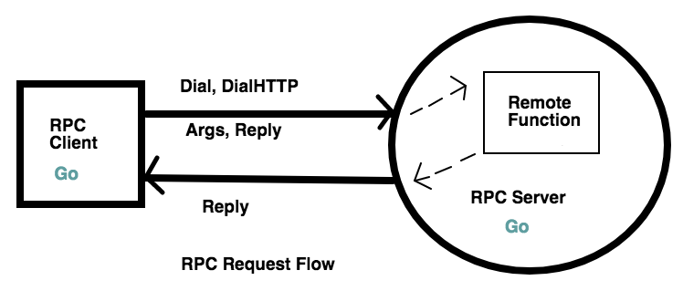

学习目标：

- 了解什么是 middleware
- 多个中间件以及链式调用
- 使用 Alice 进行链式调用
- 使用 Gorilla handlers middleware 进行日志记录
- 了解什么是RPC
- 使用Gorilla RPC 中的 JSON-RPC

## 中间件概述

中间件贯穿于整个服务器处理响应请求的过程，它可以在许多组件中定义。在我们之前学习定义路由和相关处理函数的时候，这个处理函数会对每一个请求执行相应的处理逻辑；而中间件作用的位置就在 请求到处理函数或者处理函数到响应之间。所以，中间件实际上做了这些事情：

- 在请求到达处理函数之前进行操作
- 将处理过相应逻辑操作的请求传送到处理函数
- 在响应到达处理函数之前进行操作
- 将处理过的响应返回给客户端

整个流程大概如图所示：


从图中可以看到，请求从客户端发过来之后，先经过了 AUTH MIDDLEWARE ,然后到达 FUNCTION HANDLER;响应的数据会经过 CUSTOM MIDDLEWARE,之后将处理过的响应返回给用户。如果是一个没有中间件的服务，请求直接到达 function handler 之后直接返回给客户端响应；如果配置了中间件，那么它会经过一系列的阶段，比如说 日志处理、用户认证、session 验证等等，最后才到达真正执行路由的逻辑。

这些中间件的应用场景是：

- 使用 logger 记录每一次请求的日志
- 验证用户 session 保证会话连接存活
- 认证用户信息
- 在响应中添加附加信息

中间件的作用就是当许多路由处理函数需要处理相同的逻辑功能时，可以把这些功能抽离封装起来。有了中间件，我们就可以适当的位置执行任何的日常操作，比如说认证功能。接下来让我们创建一个中间件并尝试更改HTTP请求。

## 创建一个简单的中间件

中间件的创建可以基于闭包（一个闭包方法返回另外一个方法）。这就类似于JavaScript的链式方法，一个中间件返回另外一个方法，它可以是一个中间件，也可以是一个路由处理函数。我们先来举一个闭包的例子：

1. 创建项目文件，初始化mod

   ```shell
   mkdir closureExample
   cd closureExample
   touch main.go
   go mod init closure
   ```

2. 编辑main.go文件，其中最重要的就是generator 函数，这个函数返回一个匿名函数（没有参数，返回值为整数）。其中变量 i 定义在 generator 函数内部，会被返回的匿名函数捕获，它的状态会被记住，并在每一次调用这个匿名函数的时候被更新。

   ```go
   package main
   
   import "fmt"
   
   // This function returns another function
   func generator() func () int {
   	var i = 0
   	return func () int {
   		i++
   		return i
   	}
   }
   
   func main() {
   	numGenerator := generator()
   	for i := 0; i< 5; i++ {
   		fmt.Print(numGenerator(), "\t")
   	}
   }
   ```

3. 测试执行

   ```go
   ➜  closureExample go run main.go
   1	2	3	4	5
   ```

了解了闭包的工作原理之后，我们开始利用它创建中间件：任何一个生成函数（generator function），它的返回值是一个函数，并且这个函数满足接口 http.Handler ，那么它就是一个中间件。举例如下：

1. 照例创建项目目录

   ```shell
   mkdir customMiddleware
   cd customMiddleware
   touch main.go
   go mod init middleware
   ```

2. 编写 main.go 文件

   ```go
   package main
   
   import (
   	"fmt"
   	"net/http"
   )
   
   func middleware(originalHandler http.Handler) http.Handler {
   	return http.HandlerFunc(func(w http.ResponseWriter, r *http.Request){
   		fmt.Println("Executing middleware before request phase!")
   		// Pass control back to the handler
   		originalHandler.ServeHTTP(w, r)
   		fmt.Println("Executing middleware after response phase!")
   	})
   }
   
   func handle (w http.ResponseWriter, r *http.Request){
   	// Business logic goes here
   	fmt.Println("Executing mainHandler....")
   	w.Write([]byte("OK"))
   }
   
   func main() {
   	// HandlerFunc returns a HTTP Handler
   	originalHandler := http.HandlerFunc(handle)
   	http.Handle("/", middleware(originalHandler))
   	http.ListenAndServe(":8000", nil)
   }
   ```

   中间件函数接收一个正常的HTTP路由处理函数作为参数，它返回另外一个路由处理函数。可以看到在中间件中，仍然执行原始函数的逻辑操作，但是在它执行的前后，分别做了 middleware 函数想要做的事情，可以分别操作 request 和 response 对象。这样所有去路由函数的请求都会经过中间件的处理逻辑。

3. 执行结果

   ```go
   ➜  ~ curl http://127.0.0.1:8000/
   OK
   ➜  closureExample go run main.go
   Executing middleware before request phase!
   Executing mainHandler....
   Executing middleware after response phase!
   ```

下面的流程图可以理解中间件的整个流程逻辑：


## 多个中间件以及链式调用

前面我们仅仅是创建了一个简单的中间件，作用是在请求到达真正的逻辑函数之前或者之后来做一些事情。有一些需求可能需要使用到大量的中间件，这就需要使用到链式结构。

接下来我们创建一个 cityAPI 程序来存储城市信息。为了简单起见，API有一个 POST方法，结构有两部分：城市名称和城市大小。

假设客户端仅被允许发送 JSON Content-Type 的请求到API，并且API的主要功能是返回响应并附带返回一个cookie，这个cookie 带有UTC格式的时间戳。

方法有以下两个中间件：

- 第一个：检查请求内容是否是JSON格式，如果不是不允许请求继续传递
- 第二个：在响应 cookie 中添加 Server-Time(UTC) 

在实现中间件功能之前，我们先把这个 POST 请求的 API实现了

1. 创建项目文件，初始化mod

   ```shell
   touch cityAPI/main.go  // 其他步骤省略，请自行完成
   ```

2. 编写处理 POST 请求的函数。它获取请求数据中城市的名字和面积，将信息添加到结构体实例 city

   ```go
   ype city struct {
   	Name string
   	Area uint64
   }
   
   func postHandler(w http.ResponseWriter, r *http.Request){
   	if r.Method == "POST" {
   		var tempCity city
   		decoder := json.NewDecoder(r.Body) //从请求body 中获取数据
   		err := decoder.Decode(&tempCity) // 将数据映射到 city 实例
   
   		if err != nil {
   			panic(err)
   		}
   		defer r.Body.Close()
   		fmt.Printf("Got %s city with area of %d sq miles!\n", tempCity.Name, tempCity.Area)
   
   		w.WriteHeader(http.StatusOK)
   		w.Write([]byte("201 - Created"))
   	} else {
   		w.WriteHeader(http.StatusMethodNotAllowed) 
   		w.Write([]byte("405 - Method Not Allowed"))
   	}
   }
   ```

3. 主逻辑

   ```go
   package main
   
   import (
   	"encoding/json"
   	"fmt"
   	"net/http"
   )
   ....
   func main() {
   	http.HandleFunc("/city", postHandler)
   	http.ListenAndServe(":8000", nil)
   }
   ```

4. 运行并测试

   ```shell
   go run main.go
   
   Got New York city with area of 304 sq miles!
   Got Boston city with area of 89 sq miles!
   
   ➜  ~ curl -H "Content-Type: application/json" -X POST http://127.0.0.1:8000/city -d '{"name": "New York", "area":304}'
   201 - Created                                                                                                                         ➜  ~ curl -H "Content-Type: application/json" -X POST http://127.0.0.1:8000/city -d '{"name": "Boston", "area":89}'
   201 - Created
   ```

5. 接下来创建内容检测中间件，它检测请求头中的 `MIME` 字段，如果不是 JSON 就返回响应状态 `415 - Unsupported Media Type`

   ```go
   func filterContentType(handler http.Handler) http.Handler {
   	return http.HandlerFunc(func (w http.Response, r *http.Request) {
   		log.Println("Currently in the check content type middleware")
   		// Filtering requests by MIME type
   		if r.Header.Get("Content-type") != "application/json" {
   			w.WriteHeader(http.StatusUnsupportedMediaType)
   			w.Write([]byte("415 - Unsupported Media Type. Please send JSON"))
   			return 
   		}
   		handler.ServeHTTP(w, r)
   	})
   }
   ```

6. 接着是第二个中间件，当检查内容类型正确并返回响应结果时，这个中间件会添加一个叫 Server-Time(UTC)的cookie，包含服务器的时间戳

   ```go
   func setServerTimeCookie(handler http.Handler) http.Handler {
   	return http.HandlerFunc(func (w http.ResponseWriter, r *http.Request)  {
   		handler.ServeHTTP(w, r)
   		
   		// Setting cookie to every API response
   		cookie := http.Cookie{Name: "Server-Time(UTC)", Value: strconv.FormatInt(time.Now().Unix(), 10)}
   		http.SetCookie(w, &cookie)
   		log.Println("Currently in the set server time middleware")
   	})
   }
   ```

7. 主函数

   ```go
   func main() {
   	originalHandler := http.HandlerFunc(postHandler)
   	http.Handle("/city", filterContentType(setServerTimeCookie(originalHandler)))
     // 一定要注意中间件嵌套的顺序
   	http.ListenAndServe(":8000", nil)
   }
   ```

8. 运行检测

   ```shell
   // 正确格式的请求
   ➜  ~ curl -i -H "Content-Type: application/json" -X POST http://127.0.0.1:8000/city -d '{"name": "Boston", "area":89}'
   HTTP/1.1 200 OK
   Date: Wed, 18 Mar 2020 15:59:35 GMT
   Content-Length: 13
   Content-Type: text/plain; charset=utf-8
   
   201 - Created
   
   // 错误格式的请求
   ➜  ~ curl -i  -X POST http://127.0.0.1:8000/city -d '{"name": "Boston", "area":89}'
   HTTP/1.1 415 Unsupported Media Type
   Date: Wed, 18 Mar 2020 16:00:44 GMT
   Content-Length: 46
   Content-Type: text/plain; charset=utf-8
   
   415 - Unsupported Media Type. Please send JSON
   
   // 服务器端结果
   ➜  go run main.go
   2020/03/18 23:59:35 Currently in the check content type middleware
   Got Boston city with area of 89 sq miles!
   2020/03/18 23:59:35 Currently in the set server time middleware
   2020/03/19 00:00:44 Currently in the check content type middleware
   ```

当有很多中间件需要调用，像主函数那样的调用方式就很不友好了，所以这时候需要用到一个第三包 `alice`。它能够使得调用简单并且易读。

## 使用 Alice 进行链式调用

使用 go get 安装 alice 

```go
go get github.com/justinas/alice
```

还是上面的例子，我们可以导入 alice 以替换原来的链式调用

```go
import (
  "encoding/json"
  "github.com/justinas/alice"
  "log"
  "net/http"
  "strconv"
  "time"
)

func main(){
  originalHandler := http.HandlerFunc(postHandler)
  chain := alice.New(filterContentType, setServerTimeCookie).Then(originalHandler)
  http.Handle("/city", chain)
  http.ListenAndServe(":8000", nil)
}
```

## 使用 Gorilla handlers 中间件实现日志功能

Gorilla handlers 包提供了已经预先实现好的很多日常用到的中间件。其中有些比较有用的：

- LoggingHandler: 以 Apache Common Log Format (CLF)为格式的日志
- CompressionHandler: 压缩响应包
- RecoveryHandler: 从不可期错误中恢复

这里我们使用LoggingHandler 中间件实现API的日志记录功能

```shell
go get "github.com/gorilla/handlers"
```

1. 创建新的项目，初始化mod

   ```shell
   mkdir loggingMiddleware
   cd loggingMiddleware
   touch main.go
   go mod init logging
   ```

2. 编辑 main.go 

   ```go
   package main
   
   import (
   	"log"
   	"net/http"
   	"os"
   
   	"github.com/gorilla/handlers"
   	"github.com/gorilla/mux"
   )
   
   func handle(w http.ResponseWriter, r *http.Request){
   	log.Println("Processing request!")
   	w.Write([]byte("OK!"))
   	log.Println("Finished processing request")
   }
   
   func main() {
   	r := mux.NewRouter()
   	r.HandleFunc("/", handle)
   	loggedRouter := handlers.LoggingHandler(os.Stdout, r)
   	http.ListenAndServe(":8000", loggedRouter)
   }
   ```

   `LoggingHandler` 函数将日志输出到标准输出上，并返回一个新的路由，以这个新的路由来作为启动的参数。

3. 运行并测试

   ```shell
   ➜  loggingMiddleware go run main.go
   2020/03/19 14:37:08 Processing request!
   2020/03/19 14:37:08 Finished processing request
   127.0.0.1 - - [19/Mar/2020:14:37:08 +0800] "GET / HTTP/1.1" 200 3
   
   ➜  ~ curl -i http://127.0.0.1:8000/
   ```

   可见第三行是通过 Gorilla 的日志中间件生成的，它和我们常见的Nginx标准日志很相似。

   Gorilla handlers 中还有很多其他的中间件，可以尝试的去学习使用它。除此之外，Go还有很多其他类似的库可以使用，有一个可以直接在 net/http 上使用的中间件 `Negroni(github.com/urfave/negroni)`，它提供类似 alice , Gorilla LoggingHandler 类似的方法，有兴趣可以看看。

   有兴趣的话也可以看看 `go.uuid (github.com/satori/go.uuid)` 这个库，可以用它来构建基于cookie的认证系统中间件。

## RPC概述

RPC可以在多个分布式系统之间通过进程间通信。比如说小明的计算机可以通过特定的协议格式调用小红电脑上的函数（进程），并且获取它返回的结果。这样我们就可以通过网络请求去做一些事情，而无需在本地来实现这个功能。

整个请求的过程可以分为以下几个步骤：

- 客户端准备好需要发送的函数名和参数
- 客户端通多请求连接将上面信息发送给 RPC 服务器
- 服务端获取到方法名称和参数
- 服务器执行这个远程进程
- 将结果发送回客户端
- 客户端从请求中收集信息并合理的使用

大概执行示意图如下：



Go语言提供了实现 RPC Server 和 RPC Client 的库。从上图可以看到，RPC客户端通过主机端口信息建立HTTP连接，它发送了两个东西，一个是参数，一个是应答指针。由于这是一个指针，服务端就可以更改并且将他返回，这样客户端就可以使用填充在指针中的数据。Go中RPC相关的有两个库，`net/rpc` 和 `net/rpc/jsonrpc`。

### 创建RPC服务

让我们来写一个简单的RPC服务，它的功能是将服务器的 UTC 时间返回给客户端。

1. 创建项目，初始化mod

   ```shell
   mkdir rpcServer 
   cd rcpServer
   touch main.go
   go mod init rpc
   ```

2. 我们需要创建 Args struct 以及用来接收信息的应答指针，同时还需要一个用来执行的远程函数

   ```go
   type Args struct {}
   
   type TimeServer int64 
   
   func (t *TimeServer) GiveServerTime(args *Args, reply *int64) error {
   	// Fill reply pointer to send the data back
   	*reply = time.Now().Unix()
   	return nil
   }
   ```

3. 通过 rcp.Register 来激活 TimeServer

   ```go
   import (
   	"log"
   	"net"
   	"net/http"
   	"net/rpc"
   	"time"
   )
   
   func main() {
   	timeserver := new(TimeServer)
   	rpc.Register(timeserver)
   	rpc.HandleHTTP()
   	// Listen for requests on port 1234
   	l, e := net.Listen("tcp", ":1234")
   	if e != nil {
   		log.Fatal("listen error:", e)
   	}
   	http.Serve(l, nil)
   }
   ```

要使用这个 RPC 服务，我们还需要实现一个 RPC 客户端。

### 创建 RPC 客户端

1. 创建客户端项目，初始化mod

   ```shell
   mkdir rpcClient
   cd rpcClient
   touch main.go
   go mod init rpcclient
   ```

2. 与服务端连接需要用到 rpc.DialHTTP 方法。它会返回一个 client 对象，一旦连接建立成功，就可以使用 client.Call 来电泳远程函数了

   ```go
   package main
   
   import (
   	"log"
   	"net/rpc"
   )
   
   type Args struct {
   
   }
   
   func main() {
   	var reply int64
   	args := Args{}
   
   	client, err := rpc.DialHTTP("tcp", "localhost" + ":1234")
   	if err != nil {
   		log.Fatal("dialing:", err)
   	}
   	err = client.Call("TimeServer.GiveServerTime", args, &reply)
   	if err != nil {
   		log.Fatal("arith error:", err)
   	}
   
   	log.Print("%d", reply)
   
   }
   ```

3. 接下来分别启动服务端，客户端程序，见证奇迹的时刻到了

   ```shell
   // 服务端
   ➜  rpcServer go run main.go
   
   // 客户端
   ➜  rpcClient go run main.go
   2020/03/19 15:39:31 1584603571
   ```

客户端就像一个来自服务端独立运行的程序。这两个程序可以在不同机器上运行，计算结果依旧能够被共享，这便是分布式系统的核心概念。任务被分配给不同RPC服务器，最终客户端收集这些结果以便进一步使用。

定制的RPC代码只有当客户端以及服务端都使用Go语言编写才能生效，因此为了让RPC服务器变得更加通用，我们定义基于 HTTP的 JSON-RPC，这样其他语言写的客户端就能发送 JSON 字符串并获取 JSON 响应结果。

## 使用 Gorilla RPC 提供的 JSON-RPC

Gorilla toolkit 给我们提供了很多有用的库，比如说之前用到的路由库 Mux， 中间件库 Handlers ，还有接下来需要学习的 gorilla/rpc。

假设我们在服务器端有个一JSON文件，它包含很多书籍信息（名称，ID， 作者）。客户端通过一个HTTP请求来获取书籍信息，当RPC服务器接收到了这个请求，它从本地读取并解析文件。如果给定的ID匹配到了对应的书籍，那么服务器就会将这本书的信息通过JSON格式发送给客户端。

1. 安装Gorilla RPC 

   ```shell
   go get github.com/gorilla/rpc
   ```

   这个包是对标准库中的 net/rpc 的封装，但是使用的是HTTP请求而非之前的持久连接。可以在同一台服务器上建立多个解码器，通过请求头信息中的 `Content-Type`来选择对应的解码器。服务端提供的方法可以接收 http.Request 作为参数。

2. 创建项目，初始化mod

   ```shell
   mkdir jsonRPCServer && cd jsonRPCServer
   touch main.go
   go mod init jsonrpc
   ```

3. 创建一个JSON 文件，books.json

   ```json
   [
       {
           "id": "1234",
           "name": "In the sunburned country",
           "author": "Bill Bryson"
       },
       {
           "id": "2345",
           "name": "The picture of Dorian Gray",
           "author": "Oscar Wilde"
       }
   ]
   ```

4. 接下来定义处理RPC的逻辑，一个结构体用来定义书籍信息。JSONServer 结构体用于注册成为RPC Server。它有一个RPC action 作为方法。使用 filepath 函数来读取 JSON 文件信息。

   ```go
   // Args holds arguments passed to JSON-RPC service 
   type Args struct {
   	ID string
   }
   
   // Book struct holds Book JSON structure
   type Book struct {
   	ID string `json: "id, omitempty"`
   	Name string `json: "name, omitempty"`
   	Author string `json: "author, omitempty"`
   }
   
   type JSONServer struct {}
   
   // GiveBookDetail is RPC implementation
   func (t *JSONServer) GiveBookDetail(r *http.Request, args *Args, reply *Book) error {
   	var books []Book
   
   	// Read Json file and load data
   	absPath, _ := filepath.Abs("books.json")
   	raw, readerr := ioutil.ReadFile(absPath)
   	if readerr != nil {
   		log.Println("error:", readerr)
   		os.Exit(1)
   	}
   
   	// Unmarshal JSON raw data into books array
   	marshalerr := jsonparse.Unmarshal(raw, &books)
   	if marshalerr != nil {
   		log.Println("error:", marshalerr)
   		os.Exit(1)
   	}
   
   	// Iterate over each book to find the given book
   	for _, book := range books {
   		if book.ID == args.ID {
   			// if book found, fill reply with it
   			*reply = book
   			break
   		}
   	}
   	return nil 
   }
   ```

   这跟之前的程序类似，只不过多了对参数ID的需求。我们使用了 ioutil.ReadFile 读取文件内容并且使用 json 的 unmarshal 将它转换到 books 结构中。然后循环书目列表找到匹配条目写入到 reply 指针中。

5. 完成主函数内容

   ```go
   package main
   
   import (
   	jsonparse "encoding/json"
   	"io/ioutil"
   	"log"
   	"net/http"
   	"os"
   	"path/filepath"
   
   	"github.com/gorilla/mux"
   	"github.com/gorilla/rpc"
   	"github.com/gorilla/rpc/json"
   )
   
   func main() {
   	// Create a new RPC server
   	s := rpc.NewServer()
   	// Register the type of data requested as JSON
   	s.RegisterCodec(json.NewCodec(), "application/json")
   	// Register the service by creating a new JSON server
   	s.RegisterService(new(JSONServer), "")
     
     
   	r := mux.NewRouter()
   	r.Handle("/rpc", s)
   	http.ListenAndServe(":1234", r)
   }
   ```

   这里我们需要使用 RegisterCodec 方法来注册解码类型，我们用到的是 JSON。然后使用 RegisterService 方法注册服务，开启一个正常 的HTTP 服务。

6. 运行并测试程序

   ```shell
   go run main.go
   
   ➜  ~ curl -X POST http://localhost:1234/rpc -H 'cache-control: no-cache' -H 'content-type: application/json' -d '{"method":"JSONServer.GiveBookDetail", "params": [{"ID": "1234"}], "id": "1"}'
   {"result":{"ID":"1234","Name":"In the sunburned country","Author":"Bill Bryson"},"error":null,"id":"1"}
   ```

   由于这个RPC server 已经可以支持通过HTTP接收请求信息，所以我们可以直接使用 curl 发送并获取信息，而不再需要独立编写一个客户端了。


