本文描述了安装CentOS 7 系统的过程。目的是在生产服务器上安装一套最小化系统，作为其他大型服务搭建的基础。

### 准备工作

U盘启动制作

- 下载最新版本的[Centos7 镜像](http://isoredirect.centos.org/centos/7/isos/x86_64/)，当前为7.8版本。
- U盘一个，大于8G。
- U盘启动制作工具，推荐[rufus](https://rufus.ie/)，详细使用方法网站上有。

更新服务器(可选)

在安装新的操作系统之前，可以更新服务器固件以充分利用所有功能，具体方法查看[官网]([https://www.dell.com/support/article/zh-cn/sln300663/%E6%88%B4%E5%B0%94%E6%9C%8D%E5%8A%A1%E5%99%A8%E6%93%8D%E4%BD%9C%E8%AF%B4%E6%98%8E-%E5%9C%A8poweredge%E4%B8%8A%E5%AE%89%E8%A3%85%E6%93%8D%E4%BD%9C%E7%B3%BB%E7%BB%9F?lang=zh](https://www.dell.com/support/article/zh-cn/sln300663/戴尔服务器操作说明-在poweredge上安装操作系统?lang=zh))。

从支持网站下载戴尔操作系统驱动程序包。 

1. 访问[支持网站](https://www.dell.com/support/home/cn/zh/cnbsd1/)，输入您系统的服务标签，或单击“Browse all products”并选择您的产品。
2. 单击“DRIVERS and DOWNLOADS”选项卡，将“Dell OS Driver Pack”键入关键字框中，接着下载戴尔操作系统驱动程序包，然后将其上传到 iDRAC 的[“update and rollback”部分](https://www.dell.com/support/article/zh-cn/sln292363/dell-poweredge-update-the-firmware-of-single-system-components-remotely-using-the-idrac?lang=en)。

安装源选择

要安装操作系统，必须为服务器提供源介质。安装文件可通过以下方式提供：

- DVD 光驱、
- USB设备
- PXE网络引导
- 安装的ISO文件（通过iDRAC虚拟介质）

我们这里使用通过USB安装

### U盘引导安装

具体执行步骤如下：

1. 将U盘插入服务器前置USB口，或者后置口
2. 在引导过程中按F11以选择引导设备，这里从USB启动

### 系统安装过程

如果U盘制作没问题，或者引导正确，会进入安装界面，选择 **Install CentOS Linux 7**

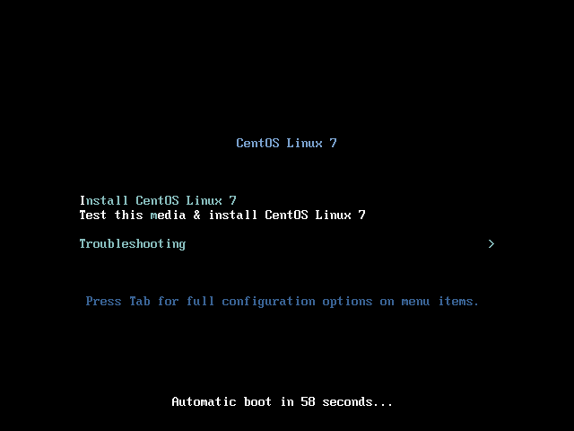


完全启动之后会进入配置界面


需要配置的选项有：时区时间、系统安装位置，其他的默认就行，需要定制的请自行研究。

时区选择界面，国内的话选择东八区上海就行

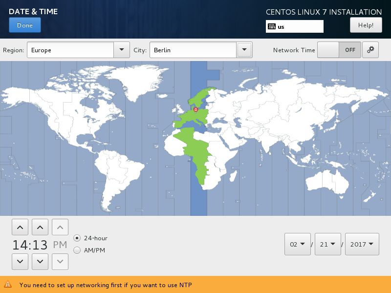

系统安装位置

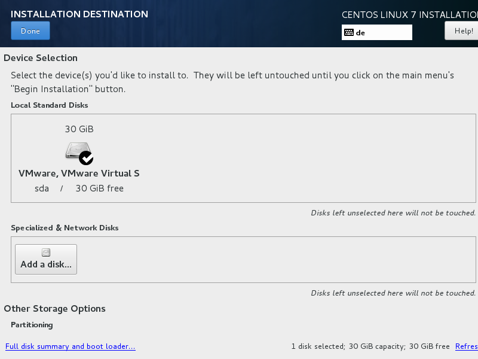

图片中只有一块儿30G的硬盘，实际服务器中会有很多的硬盘，一般会将硬盘做成两组RAID，一组安装系统，一组数据存储；选择需要安装系统的RAID盘，假设这个磁盘大小为500G。

利用LVM新建系统，默认会分配四个分区，分别为 / , /boot/efi，/home，以及swap分区，我会重新分配存储，给根目录100G，swap大小为内存的一半（如果内存特别大，最大16G估计够了，不够后期再加），其他默认，剩下的容量全部分配给home目录，至少还剩400G左右。如果懒得分，默认也行。

系统分配好后，回到配置界面，如果没问题了，就选择下一步开始安装。在安装过程界面会有设置用户密码的选项，记得把root密码配置好。

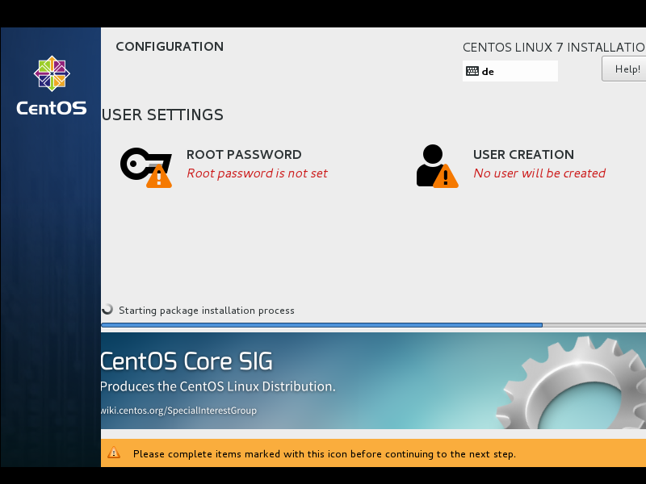

等待系统安装完成，按重启按键，正常情况下就能顺利进入安装好的系统了，在命令行登录界面输入root的用户名密码登录系统。

### 系统初始化配置

**切记在系统配置好安全设置之前不要优先配置网络！！！**

1. 关闭selinux

   selinux 开启之后限制太多，没有深入研究之前建议直接关闭

   ```shell
   setenforce 0
   vi /etc/selinux/config
   修改SELINUX的值（enforcing为开启，disabled为关闭)
   SELINUX=disabled
   
   注意：别错误修改SELINUXTYPE的值为disabled，误改会导致系统无法启动
   ```

2. SSH配置

   ssh最基本的安全配置就是修改默认登录端口，禁止root直接登录，有条件的还可以设置禁止密码登录，只能使用公钥登录。

   ```shell
   vi /etc/ssh/sshd_confg
   修改
   Port xxx
   PermitRootLogin no
   UseDNS no
   
   systemctl restart sshd  //重启sshd服务让配置生效
   ```

3. 防火墙配置

   开启系统防火墙，centos 7 使用的是 firewalld，一般配置文件在/etc/firewalld/zones/public.xml，可以手动修改，也可以通过命令行

   ```shell
   启动firewalld并设为开机自启，执行如下指令：
   systemctl start firewalld.service
   systemctl enable firewalld.service
   记得将ssh端口添加到规则：
   firewall-cmd --permanent --zone=public --add-port=xxx/tcp
   firewall-cmd --reload
   ```

4. 创建登录账户

   由于我们禁止了root的直接登录，所以需要创建一个能够登录的普通账户

   ```shell
   useradd jack
   passwd jack
   ```

5. 配置并启动网络

   ```shell
   cd /etc/sysconfig/network-scripts/
   vi ifcfg-em1
   
   TYPE=Ethernet
   PROXY_METHOD=none
   BROWSER_ONLY=no
   BOOTPROTO=static
   DEFROUTE=yes
   IPV4_FAILURE_FATAL=no
   IPV6INIT=yes
   IPV6_AUTOCONF=yes
   IPV6_DEFROUTE=yes
   IPV6_FAILURE_FATAL=no
   IPV6_ADDR_GEN_MODE=stable-privacy
   NAME=em1
   UUID=xxxx
   DEVICE=em1
   ONBOOT=yes
   IPADDR=IP地址
   NETMASK=子网掩码
   GATEWAY=网关
   IPV6ADDR=IPv6地址
   IPV6_DEFAULTGW=IPv6网关
   DNS1=223.5.5.5
   DNS2=114.114.114.114
   
   systemctl restart network
   ```

6. 更新系统

   ```shell
   查看当前系统版本
   cat /etc/*release*
   
   安装EPEL源（可选）
   yum -y install epel-release
   
   更新系统
   yum update
   
   更新系统之后，条件允许下重启系统
   reboot
   ```

7. 增加swap分区（可选）

   正如前面所说，如果安装系统的时候swap分配小了，可以手动增加一些

   ```shell
   查看当前分区情况
   free -m
   
   增加 swap分区，容量为1GB
   dd if=/dev/zero of=/var/swap bs=1024 count=1024000
   
   设置交换文件
   mkswap /var/swap
   
   立即激活启用交换分区
   swapon /var/swap
   
   添加系统引导时自启动运行
   vi /etc/fstab
   
   添加一行
   /var/swap swap swap defaults 0 0
   
   如果不需要了，收回 swap 空间
   swapoff /var/swap
   
   从文件系统中回收
   rm /var/swap
   ```

### DELL 服务器 RAID 配置

1. 在系统启动期间，按**F2**键进入**System Setup**（系统设置）。

2. 单击**Device Settings**（设备设置）。
   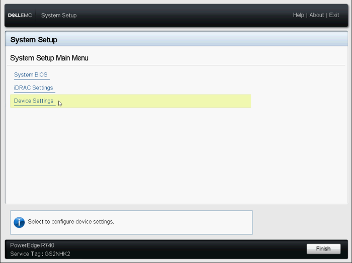

   **图1**：System Setup（系统设置）主菜单

3. 单击所需的**RAID controller**（RAID控制器）设备。
   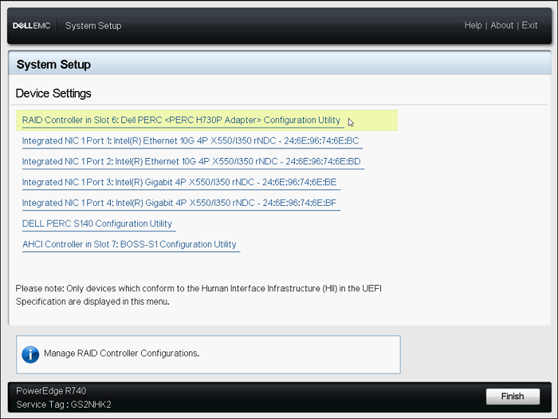

   **图2**：Device（设备）菜单

4. 单击**Configuration Management**（配置管理）。
   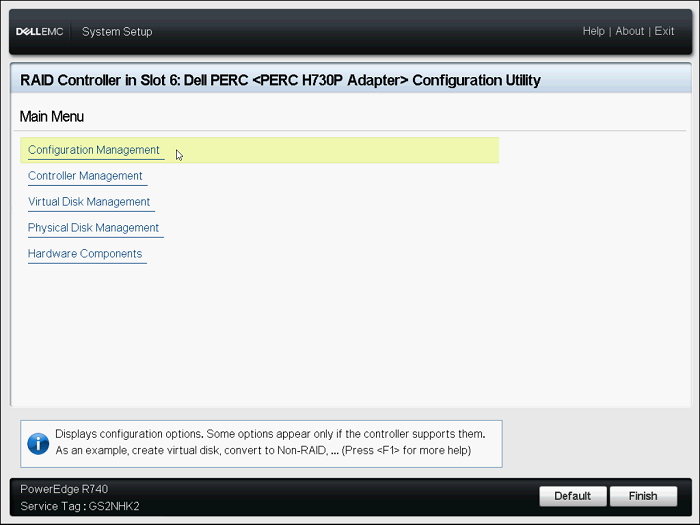

   **图3**：Configuration Utility（配置实用程序）主菜单

5. 单击**Create Virtual Disk**（创建虚拟磁盘）。
   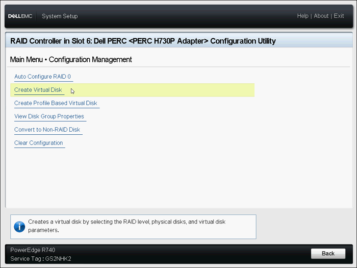

   **图4**：Configuration Management（配置管理）菜单

6. 现在会显示下面的选项列表以定义虚拟磁盘参数：

   - **Select RAID level**（选择RAID级别）— 允许您选择所需的RAID级别。

   - Secure Virtual Disk

     （安全虚拟磁盘）— 如果您要创建受保护的虚拟磁盘，请选择Secure Virtual Disk（安全虚拟磁盘）。

     **注**：仅当安全密钥已配置时，Secure Virtual Disk（安全虚拟磁盘）选项默认才会处于启用状态并已选中。仅会列出SED物理磁盘。

   - Select Physical Disks From

     （从以下选项中选择物理磁盘）— 可让您选择物理磁盘容量之一：

     - Unconfigured Capacity（未配置的容量）：在未配置的物理磁盘上创建虚拟磁盘。
     - Free Capacity（可用容量）：利用已是虚拟磁盘的一部分未使用的物理磁盘容量。

   - **Select Physical Disks**（选择物理磁盘）— 如果您要选择从中创建虚拟磁盘的物理磁盘，请单击Select Physical Disks（选择物理磁盘）。如果您选择Unconfigured Capacity（未配置的容量）作为物理磁盘容量，则会显示此选项。

   - **Select Disk Groups**（选择磁盘组）— 如果您要选择从中创建虚拟磁盘的磁盘组，请单击Select Disk Group（选择磁盘组）。如果您选择Free Capacity（可用容量）作为物理磁盘容量，将会显示此选项。

   - **Configure Virtual Disk Parameters**（配置虚拟磁盘参数）— 允许您在创建虚拟磁盘时设置虚拟磁盘参数。

    

7. 单击**Select Physical Disks**（选择物理磁盘）。
   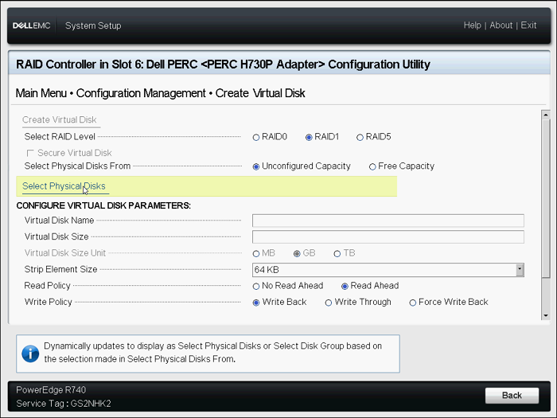

   **图5**：Create Virtual Disk（创建虚拟磁盘）菜单

8. 选择所需的驱动器，然后单击**Apply Changes**（应用更改）。
   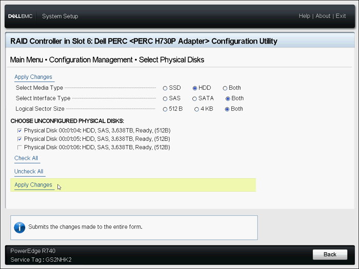

   **图6**：选择驱动器

9. 成功执行该操作后，单击**OK**（确定）。

10. 命名新的虚拟磁盘，然后选择所需的设置。

11. 单击**Create Virtual Disk**（创建虚拟磁盘）。
    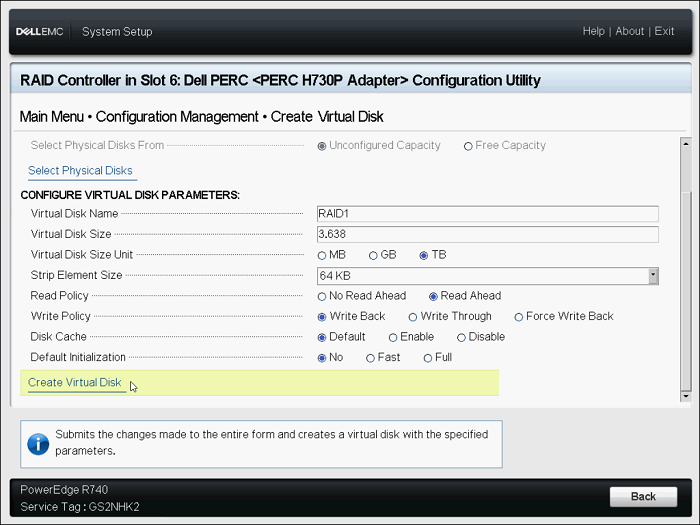

    **图7**：Create Virtual Disk（创建虚拟磁盘）

12. 选择**Confirm**（确认），然后单击**Yes**（是）。

13. 此时便已成创建**虚拟磁盘**。单击**OK**（确定）

14. 需要配置多个RAID盘，请重复步骤。