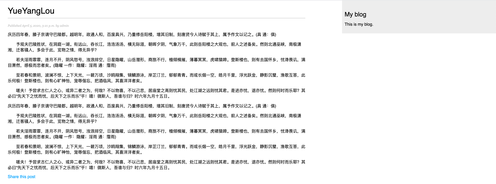
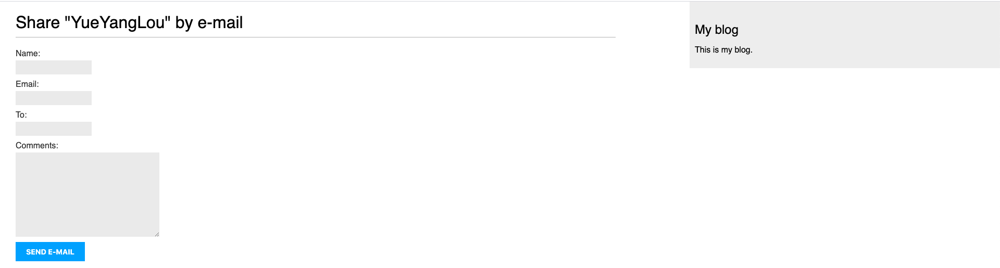
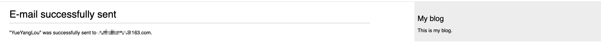
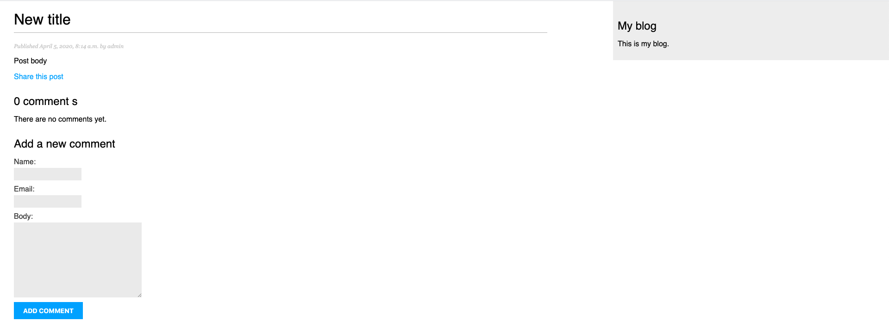
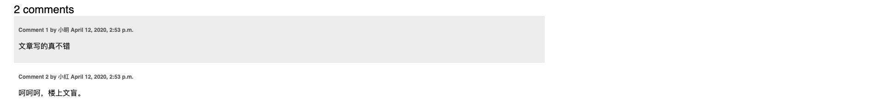
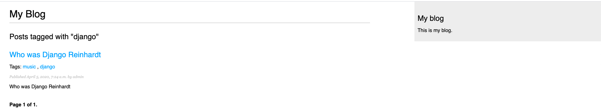
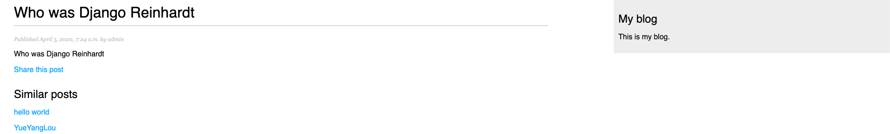

上一篇博客中我们实现了一个基本的博客程序，现在我们给它增加一些高阶功能，使这个博客系统更加实用。

功能实现：

- 编写通过邮件分享文章功能
- 给文章添加评论功能
- 给文章添加标签功能
- 推荐类似博客功能

学习知识点：

- Django 发送邮件功能
- 创建表单并且添加到视图当中
- 通过models创建表单
- 集成第三方应用
- 构建复杂QuerySets

## 通过邮件分享文章

首先我们来实现邮件分享功能，我们需要做以下事情：

- 创建一个表单，能够让用户填写他们的名字、邮箱、发送人以及额外的留言
- 在view.py 中新建一个view处理通过post发送过来的数据，然后发送邮件。
- 在 blog应用的 urls.py 中添加一个URL匹配到新的视图
- 创建模板来显示这个表单

### 实用Django 创建表单

Django 自带了表单框架，它能够让我们方便的定义表单，修改它的显示以及提供输入验证功能。Django表单框架提供了一种灵活的方式来渲染表单和处理数据。

它通过两个基类来创建表单：

- Form: 用于创建基本表单
- ModelForm: 通过绑定数据模型实例来创建表单

首先在 blog 应用中创建 forms.py ，编写代码：

```python
from django import forms

class EmailPostForm(forms.Form):
    name = forms.CharField(max_length=25)
    email = forms.EmailField()
    to = forms.EmailField()
    comments = forms.CharField(required=False, widget=forms.Textarea)
```

我们来看一下这个类创建了些什么：

name 字段是 CharField 类型，这种类型最终会渲染成 `<input type="text">` HTML标签。每一个类型都有它默认的 widget 属性用于决定它会渲染成为什么样的HTML。比如说后面的 comments 字段就自定义了 widget 为 Textarea，这样它会渲染为 `<textarea>` ，而不是默认的`<input>`标签。

不同的表单类型也有自己的验证规则。比如说 email 和 to 字段，这两个 EmailField 类型就会要求填写时候必须符合邮件地址规则，否则就会报 forms.ValicationError的异常并且这个表单项不会被通过。我们上面用到的表单验证还有 name 中max_length 规定字段的长度；comments 中 required 规定是否必须要求填写。

这里只使用到了很少的表单字段，更多的字段可以参考官方文档：https://docs.djangoproject.com/en/3.0/ref/forms/fields/

### 在视图中处理表单

我们需要在视图中添加一个新的处理函数，当用户提交表单的时候用来处理表单数据、发送邮件。

编辑 blog 应用中的 views.py 文件：

```python
def post_share(request, post_id):
    # Retrieve post by id
    post = get_object_or_404(Post, id=post_id, status='published')
    
    if request.method == 'POST':
        # Form was submitted
        form = EmailPostForm(request.POST)
        if form.is_valid():
            # Form fields passed validation
            cd = form.cleaned_data()
            # send email
    else:
        form = EmailPostForm()
    return render(request, 'blog/post/share.html', {'post': post, 'form': form})
```

这个视图的工作原理大概为：

- 定义 post_share 视图， 接收 request 和 post_id 作为参数。
- 使用 get_object_or_404() 获取id 为 post_id， 状态为 published 的文章。
- 通过判断 request 的请求方式来处理表单被提交的情况和表单初始化的情况：这里假设如果是GET请求，我们就渲染一个空的表单；如果是POST请求，说明用户提交了数据，我们需要对提交的数据进行逻辑处理。

### 通过Django 发送邮件

Django 自带了邮件发送的模块，我们只需要调用就可以。不过在调用之前我们需要配置好 Simple Mail Transfer Protocol(SMTP) 邮件服务。这些配置需要写入到项目中的 settings.py 文件中。

- EMAIL_HOST:  SMTP服务器的地址
- EMAIL_PORT:  SMTP服务器的端口
- EMAIL_HOST_USER:  SMTP服务器的用户
- EMAIL_HOST_PASSWORD: SMTP服务器的用户密码
- EMAIL_USE_TLS: 是否使用 Transport Layer Security(TLS) 安全连接
- EMAIL_USE_SSL: 是否实用隐式TLS安全连接

如果你手头没有能用的SMTP服务，我们可以实用Django自带的虚拟功能，它会将邮件发送到 console 终端。这个配置是修改 settings.py ：

```python
EMAIL_BACKEND = 'django.core.mail.backends.console.EmailBackend'
```

我们目前能够选择的SMTP服务商由很多，国内比如163，QQ邮箱；国外可以使用 Gmail邮件，如果是这些服务商的邮件，大概需要的配置如下：

```python
EMAIL_HOST = 'smtp.gmail.com'
EMAIL_HOST_USER = 'your_account@gmail.com'
EMAIL_HOST_PASSWORD = 'your_password'
EMAIL_PORT = 587
EMAIL_USE_TLS = True
```

配置好了之后我们可以使用 shell 命令行来测试是否能够成功发送邮件：

```shell
python manage.py shell
>>> from django.core.mail import send_mail
>>> send_mail('Django mail', 'This e-mail was sent with Django', 'your_account@gmail.com', ['your_account@gmail.com'], fail_silently=False)
1
```

这个 send_mail() 方法接收的参数为 邮件主题，邮件内容，发送邮件的账号，接收邮件账号列表，同时我们设置 fail_silently=False 这样，当邮件发送失败后会有报错信息提示。如果返回结果是1，那么说明你的邮件发送成功了。

提示：有些邮件服务商会有安全设置，你需要降低安全等级才能通过SMTP来发送邮件。具体可以参考服务商的设置，对与Gmail 有以下两个选项值得考虑：

https://myaccount.google.com/lesssecureapps

https://accounts.google.com/b/0/displayunlockcaptcha

接下来我们修改 views.py 中的 post_share 视图函数：

```python
from django.core.mail import send_mail

def post_share(request, post_id):
    # Retrieve post by id
    post = get_object_or_404(Post, id=post_id, status='published')
    sent = False
    
    if request.method == 'POST':
        # Form was submitted
        form = EmailPostForm(request.POST)
        if form.is_valid():
            # Form fields passed validation
            cd = form.cleaned_data
            # send email
            post_url = request.build_absolute_uri(post.get_absolute_url())
            subject = f"{cd['name']} recommends you read {post.title}"
            message = f"Read {post.title} at {post_url}\n\n" \
                      f"{cd['name']}\'s comments: {cd['comments']}"
            send_mail(subject, message, 'admin@myblog.com', [cd['to']])
            sent = True
    else:
        form = EmailPostForm()
    return render(request, 'blog/post/share.html', {'post': post, 'form': form, 'sent': sent})
```

将 admin@myblog.com 替换成你的真实邮箱地址。

上面代码中我们设置了一个变量 sent ，当POST 发送之后我们将这个值设置成了 True， 这方便我们之后用于在模板中显示邮件发送成功标识。

需要注意我们用于给用户推送文章地址的 post_url 的构造过程，这里用到了两个函数。

接下来我们还需要在 blog 应用中的 urls.py 中添加匹配 post_share 视图的URL

```python
 path('<int:post_id>/share/', views.post_share, name='post_share'),
```

### 在模板中渲染表单

终于来到了模板渲染这一步，在 blog/templates/blog/post/ 目录下面创建 share.html 文件：

```html


Share a post


  
    <h1>E-mail successfully sent</h1>
    <p>
      "{{ post.title }}" was successfully sent to {{ form.cleaned_data.to }}.
    </p>
  
    <h1>Share "{{ post.title }}" by e-mail</h1>
    <form method="post">
      {{ form.as_p }}
      
      <input type="submit" value="Send e-mail">
    </form>
  

```

可以注意到这个模板中用到了我们之前传过来的 send 变量，当 sent 为 True 时候，页面显示邮件发送成功；否则就会渲染提交表单。

这里的表单格式 `<form method="post">` 明确的指明了提交方式为 POST，同时在这个表单中，我们将之前定义好的表单通过使用方法 as_p ，将每一项渲染为 `<p>`标签。这个渲染方式还有其他，比如说 as_ul 渲染为列表，as_table 渲染为表格。如果你想逐个字段的渲染，也可以自行循环渲染：

```html

  <div>
    {{ field.errors }}
    {{ field.label_tag }} {{ field }}
  </div>

```

还需要注意的一点是我们用到了 ` `这个模板标签，这是为了防止 cross-site request forgery(CSRF)攻击。具体可以参考这里：https://owasp.org/www-community/attacks/csrf

这个模板标签在渲染之后前端代码大概如下：

```html
<input type='hidden' name='csrfmiddlewaretoken' value='26JjKo2lcEtYkGo V9z4XmJIEHLXN5LDR' />
```

默认情况下每一个 POST 请求Django 都会去验证这段 CSRF token，所以之后的所有POST表单都要记得带上这个标签。

接下来在 blog/post/detail.html 中加入跳转到分享页面的链接：

```html
{{ post.body|linebreaks }}
<p>
    <a href="">Share this post</a>
</p>
```

这里能够学习到的知识点是：使用 url 模板标签，通过 blog 命名空间以及 post_share 这个URL名称来构建动态URL，同时传入参数的方式就是在后面添加所需要的字段。

现在我们通过运行 python manage.py runserver 来检查这个功能的实现。

打开链接  http://127.0.0.1:8000/blog/ 点击任何一个文章，进入详细内容：



点击下面的 `Share this post`，就进入了我们的分享功能的表单页面



发送成功之后的页面效果



## 创建评论系统

创建文章评论系统的大概流程是：

1. 创建用于保存评论的数据模型
2. 创建一个表单，用于提交评论，并且验证用户的输入。
3. 创建一个视图用来处理提交过来的数据，并且将新的评论保存到数据库。
4. 编辑文章详情模板，将所有相关评论显示出来，并且显示添加评论的表单。

### 创建模型

编辑 blog 应用中的 models.py

```python
class Comment(models.Model):
    post = models.ForeignKey(Post,
                             on_delete=models.CASCADE,
                             related_name='comments')
    name = models.CharField(max_length=80)
    email = models.EmailField()
    body = models.TextField()
    created = models.DateTimeField(auto_now_add=True)
    updated = models.DateTimeField(auto_now=True)
    active = models.BooleanField(default=True)

    class Meta:
        ordering = ('created',)

    def __str__(self):
        return f'Comment by {self.name} on {self.post}'
```

这个模型中比较重要的一项就是 post 字段的 ForeignKey 类型，它将每一条评论与一篇文章关联。这是多对一的关系类型，表示每个评论属于一篇文章，但是一篇文章会有很多评论。

同时这个字段中的 related_name 属性可以让你将相关对象的关系命名从而可以从关联对象反查到这个对象。翻译成人话就是，你可以实用 `comment.post` 查找到这条评论属于的文章，也可以实用 `post.comments.all()` 来查找出这篇文章关联的所有评论。如果你不显示的定义这个属性，Django 也会为你自动生成， 它会使用模型名称的小写加上 _set，也就是最后拼成：`comment_set` 。

更多关于多对一的关系可以在官方文档中查看：https://docs.djangoproject.com/en/3.0/topics/db/examples/many_to_one/

接下来我们通过 migration 将模型映射到数据库中

```shell
python manage.py makemigrations blog

Migrations for 'blog':
  blog/migrations/0002_comment.py
    - Create model Comment

python manage.py migrate

Operations to perform:
  Apply all migrations: admin, auth, blog, contenttypes, sessions
Running migrations:
  Applying blog.0002_comment... OK
```

执行完这个操作之后，数据库中就会多出一个表 `blog_comment`

我们可以将这个新的模型添加到管理后台中，方便我们管理数据。编辑 admin.py 文件：

```python
from .models import Post, Comment
@admin.register(Comment)
class CommentAdmin(admin.ModelAdmin):
    list_display = ('name', 'email', 'post', 'created', 'active')
    list_filter = ('active', 'created', 'updated')
    search_fields = ('name', 'email', 'body')
```

这样评论的模型就集成到后台管理了

### 为评论模型创建表单

前面邮件分享的表单我们用到了 Form 类，这里由于需要生成模型 Comment 相关的表单，我么你可以使用 ModelForm 类来关联操作。编辑 blog 应用中的 forms.py 文件：

```python
from .models import Comment
class CommentForm(forms.ModelForm):
    class Meta:
        model = Comment
        fields = ('name', 'email', 'body')
```

从上面的代码可以看出，通过模型建立表单非常简单，只需要在 Meta 类中 model 字段关联想要使用的模型即可。

每个模型字段类型都会有相应的默认表单字段类型，同时你定义模型所做的约束也会被应用到表单验证中。默认情况下Django 会为每一个模型中的字段定义一个表单字段。然而你可以在 fields 字段中指定想要创建的字段，或者使用 exclude 排除不想要的字段。比如说我们的 CommentForm 仅仅需要用户填写 name, email, body 这三个表单字段。

### 在视图中处理 ModelForms

我们可以在文章详情视图中加入对评论表单的处理，编辑 views.py 文件：

```python
from .models import Post, Comment
from .forms import EmailPostForm, CommentForm

def post_detail(request, year, month, day, post):
    post = get_object_or_404(Post, slug=post,
                                   status='published',
                                   publish__year=year,
                                   publish__month=month,
                                   publish__day=day)

    # List of active comments for this post
    comments = post.comments.filter(active=True)

    new_comment = None

    if request.method == 'POST':
        # A comment was posted
        comment_form = CommentForm(data=request.POST)
        if comment_form.is_valid():
            # Create Comment object but don't save to database yet
            new_comment = comment_form.save(commit=False)
            # Assign the current post to the comment
            new_comment.post = post
            # Save the comment to the database
            new_comment.save()
    else:
        comment_form = CommentForm()

    return render(request,
                  'blog/post/detail.html',
                  {'post': post,
                   'comments': comments,
                   'new_comment': new_comment,
                   'comment_form': comment_form})
```

让我们看一下都添加了哪些功能。首先我们在 post_detail 这个使用中同时显示文章内容和它相关评论。我们使用了一个QuerySet 来获取所有激活的评论

```python
comments = post.comments.filter(active=True)
```

这里就用到了我们之前提到过的关联命名，我们没有从Comment 这个模型中直接建立QuerySet来查询与本文章相关的评论，而是使用单个文章 post 对象来检索所有与它关联的 Comment 对象。

我们这里也新建了一个变量 new_comment 并赋值为 None，用于创建评论时使用。

如果请求是 GET 我们新建一个评论表单实例 `comment_form = CommentForm()`，而如果请求是POST，那我们使用发过来的数据实例化表单，并使用 `is_valid()` 方法验证这些数据。

如果表单验证失败，我们将会在模板中渲染这些错误信息。如果验证成功，我们做以下操作：

1. 通过调用表单的 save() 方法来创建一个新的 Comment 对象，并将它赋值给 new_comment

   `new_comment = comment_form.save(commit=False)`

   save 方法创建一个与表单关联的模型实例，并保存到数据库中。这里我们使用了 `commit=False`，这样创建了实例，但是没有提交到数据库。这样我们就能在最终提交之前再对实例数据进行一些调整。

2. 我们将当前的文章 post 关联到新创建的实例中 `new_comment.post = post` 这样做的目的就是为了申明这个评论属于这篇文章。

3. 最后再使用 save 方法将数据存入数据库。

### 在文章详情模板中添加评论

接下来我们对 post/detail.html 模板做如下调整：

- 显示文章的评论总数
- 显示评论列表
- 显示添加评论的表单

首先是添加总评论， 修改 post/detail.html 模板，再 content 块中添加：

```html
  
    <h2>
      {{ total_comments }} comment {{ total_comments|pluralize }}
    </h2>
  
```

这段代码在模板中使用了 Django ORM ，它执行了 QuerySet 的 `comments.count()`。需要注意到， Django 模板语言中不使用括号调用函数。 `` 标签可以将值赋值到新的变量中， 这个标量可以在 ``之前任意使用。``标签的好处就是，我们调用一次ORM之后可以多次使用，避免了多次调用数据库或者多次执行耗时运算的成本。

这里有一个有意思的模板标签 `pluralize` 它能够根据 `total_comments`的数值多少来决定 comment 这个单词显示为单数还是复数。

接下来我们接着展示评论列表：

```html
  
    <div class="comment">
      <p class="info">
        Comment {{ forloop.counter }} by {{ comment.name }}
        {{ comment.created }}
      </p>
      {{ comment.body|linebreaks }}
    </div>
  
    <p>There are no comments yet.</p>
  
```

这里我们使用`` 模板标签来循环 `comments`。如果没有评论，我们会默认显示没有的信息。我们使用`{{ forloop.counter }}`这个变量来显示当前循环的次数。后面就显示一些评论的用户名，时间，以及内容。

最后，我们需要渲染评论表单或者当评论成功之后提交显示成功页面：

```html
  
    <h2>Your comment has been added. </h2>
  
    <h2>Add a new comment </h2>
    <form action="post">
      {{ comment_form.as_p }}
      
      <p><input type="submit" value="Add comment"></p>
    </form>
  
```

这段代码很简单，就是当POST提交成功之后，`new_comment` 会是一个评论实例，不为None，这样就会显示提交成功的信息。反之，会渲染出评论表单

重启服务，打开 http://127.0.0.1:8000/blog/ 点入一个文章，我们查看以下实现效果：



添加评论之后



这个时候如果我们通过http://127.0.0.1:8000/admin/blog/comment/将其中的任何一条评论状态Active关闭，再次刷新文章页面，就会发现这条评论不再显示了。

## 添加标签功能

实现了评论功能之后，我们应该就可以使用相同的方式来实现添加标签的功能。但是除了自己实现，我们也可以使用第三方已经实现好的功能来利用。比如这个标签功能，我们就可以用 django-taggit 这个应用，它提供了一个Tag模型和管理器，能够轻松的将标签添加到任何其他模型。具体代码可以看：https://github.com/jazzband/django-taggit

首先通过 pip 安装应用：

```shell
pip install django_taggit==1.2.0
```

然后再 settings.py 中将应用添加到 INSTALLED_APPS 中

```shell
INSTALLED_APPS = [
    # ...
    'blog.apps.BlogConfig',
    'taggit',
]
```

修改 blog 应用中的 models.py ，将 `TaggableManager` 添加到 `Post` 模型中

```python
from taggit.managers import TaggableManager
class Post(models.Model): 
  # ....
  tags = TaggableManager()
```

这个tags 管理器可以允许我们从 Post 对象中添加，获取，删除标签。

由于模型发生了变化，我们需要对数据库进行迁移

```shell
python manage.py makemigrations blog
python manage.py migrate

Operations to perform:
  Apply all migrations: admin, auth, blog, contenttypes, sessions, taggit
Running migrations:
  Applying taggit.0001_initial... OK
  Applying taggit.0002_auto_20150616_2121... OK
  Applying taggit.0003_taggeditem_add_unique_index... OK
  Applying blog.0003_post_tags... OK
```

这样数据库就可以使用 django-taggit 模型了，我们来练习一下怎么使用 tags 管理器

```shell
python manage.py shell
>>> from blog.models import Post
>>> post = Post.objects.get(id=1)
```

向这个文章添加一些标签

```shell
>>> post.tags.add('music', 'jazjz', 'django')
>>> post.tags.all()
<QuerySet [<Tag: music>, <Tag: django>, <Tag: jazjz>]>
```

删除标签

```shell
>>> post.tags.remove('jazjz')
>>> post.tags.all()
<QuerySet [<Tag: music>, <Tag: django>]>
```

也可以通过http://127.0.0.1:8000/admin/taggit/tag/ 来管理标签

通过http://127.0.0.1:8000/admin/blog/post/ 可以修改文章所属的标签。

接下来编辑视图让文章显示标签，修改文件为 blog/post/list.html，在文章标题后面添加

```html
<p class="tags">Tags:{{ post.tags.all|join:", "}}</p>
```

这时候再次查看页面就能够看到每个标题下面都有标签列表了。

接下来我们编写 post_list 视图，当选定标签以后，我们能够列出所有具有这个标签的文章。

```python
from taggit.models import Tag

def post_list(request, tag_slug=None):
    object_list = Post.published.all()
    tag = None

    if tag_slug:
        tag = get_object_or_404(Tag, slug=tag_slug)
        object_list = object_list.filter(tags__in=[tag])

    paginator = Paginator(object_list, 3) 
    # ...
```

现在这个 post_list 视图的工作原理是：

1. 视图函数接收一个可选参数， tag_slug 默认为 None，这个参数通过URL传递
2. 函数的第一步就是获取所有发表的文章，如果给定了 tag ，我们获取到这个Tag对象。
3. 然后我们过滤出包含指定标签的文章。由于这是一个多对多的关系，你必须通过给定列表中的标签来过滤文章，这里我们的列表中只包含一个元素。当一个模型的多个对象和另外一个模型的多个对象关联时，就会出现多对多关系。在我们的应用中，一个帖子可以有多个标签，一个标签也可以与多个帖子相关联。具体可以查看官方文档：https://docs.djangoproject.com/en/3.0/topics/db/examples/many_to_many/

最后我们修改 render() 函数，将 tag 变量传入模板

```python 
def post_list(request, tag_slug=None):
    object_list = Post.published.all()
    tag = None

    if tag_slug:
        tag = get_object_or_404(Tag, slug=tag_slug)
        object_list = object_list.filter(tags__in=[tag])

    paginator = Paginator(object_list, 3) # 3 posts in each page
    page = request.GET.get('page')
    try:
        posts = paginator.page(page)
    except PageNotAnInteger:
        # If page is not an integer deliver the first page
        posts = paginator.page(1)
    except EmptyPage:
        # If page is out of range deliver last page of results
        posts = paginator.page(paginator.num_pages)
    return render(request,
                 'blog/post/list.html',
                 {'page': page,
                  'posts': posts,
                  'tag': tag}
                 )
```

修改 urls.py 中的URL匹配，记得注释掉之前的 基于类的视图，并且修改 blog/post/list.html 中关于分页的代码

`  `

```python
    path('', views.post_list, name='post_list'),
    # path('', views.PostListView.as_view(), name='post_list'),
    path('tag/<slug:tag_slug>/', views.post_list, name='post_list_by_tag'),
```

可以看到我们的两个URl都指向了同一个视图函数，不同之处在于，当匹配到第一个，post_list 没有任何参数，而第二个会带有 tag_slug 参数。

编辑 blog/post/list.html 模板：

```html
  


My Blog


  <h1>My Blog</h1>
  
    <h2>Posts tagged with "{{ tag.name }}"</h2>
  
  
    <h2>
      <a href="{{ post.get_absolute_url }}">
        {{ post.title }}
      </a>
    </h2>
    <p class="tags">
      Tags:
      
        <a href="">
          {{ tag.name }}
        </a>
        , 
      
    </p>
    <p class="date">
      Published {{ post.publish }} by {{ post.author }}
    </p>
    {{ post.body|truncatewords:30|linebreaks }}
  
  

```

上面的代码最主要的修改就是，循环文章的所有标签，并给每一个标签生成一个特定的URL并传入tag_slug 参数，这样我们点击链接的时候就能够显示相关标签的文章了。

我们重启服务，测试效果:



## 推荐类似博客功能

既然我们实现了文章添加标签的功能，那么我们就可以用这个功能来实现一些有趣的事情。由于内容相似的文章或多或少会有一些相似的标签，那我们可以根据这个编写一个功能，通过共享标签数量来显示类似的文章。

大概的思路为以下几步：

1. 获取当前文章的所有标签
2. 获取所有标记为这些标签的文章
3. 在获取的文章列表中排除当前文章
4. 按照与当前文章共享标签的数量来给其他文章排序
5. 如果多个文章具有相同的标签数，我们推荐最新发表的文章
6. 通过限制查询来获取你想推荐数量的文章

这些步骤需要在 post_detail 视图中，通过一个复杂的 QuerySet 查询来实现。修改views.py 文件：

```python 
from django.db.models import Count
```

引入Django ORM 的 Count 聚合功能。具体可以查看文档：https://docs.djangoproject.com/en/3.0/topics/db/aggregation/

在 post_detail 函数的 render 之前添加功能

```python
    # List of similar posts
    post_tags_ids = post.tags.values_list('id', flat=True)
    similar_posts = Post.published.filter(tags__in=post_tags_ids)\
                                  .exclude(id=post.id)
    similar_posts = similar_posts.annotate(same_tags=Count('tags'))\
                                .order_by('-same_tags','-publish')[:4]
```

这段代码的功能：

1. 获取当前文章标签相关ID列表。这里使用到了 `values_list()`这个QuerySet 返回给定字段值的元组，传入的 flat=True 能够使得返回结果为[1,2,3,4,...] 而不是 [(1,), (2,), (3,) ...]
2. 获取所有包含这些标签的文章，并排除自己
3. 通过 Count 聚合函数生成了一个计算字段 same_tags， 这个字段包含与查询的所有标签共享的标记数量
4. 将结果根据指定字段排序，并截取前四个文章结果

将获取到的结果传入 render 函数

```python
    return render(request,
                  'blog/post/detail.html',
                  {'post': post,
                   'comments': comments,
                   'new_comment': new_comment,
                   'comment_form': comment_form,
                   'similar_posts': similar_posts})
```

编辑 blog/post/detail.html 模板，在文章评论列表之前加入如下代码:

```html
  <h2>Similar posts</h2>
  
    <p>
      <a href="{{ post.get_absolute_url }}">{{ post.title }}</a>
    </p>
  
    There are no similar posts yet.
  
```

这时候详情页的结果：



